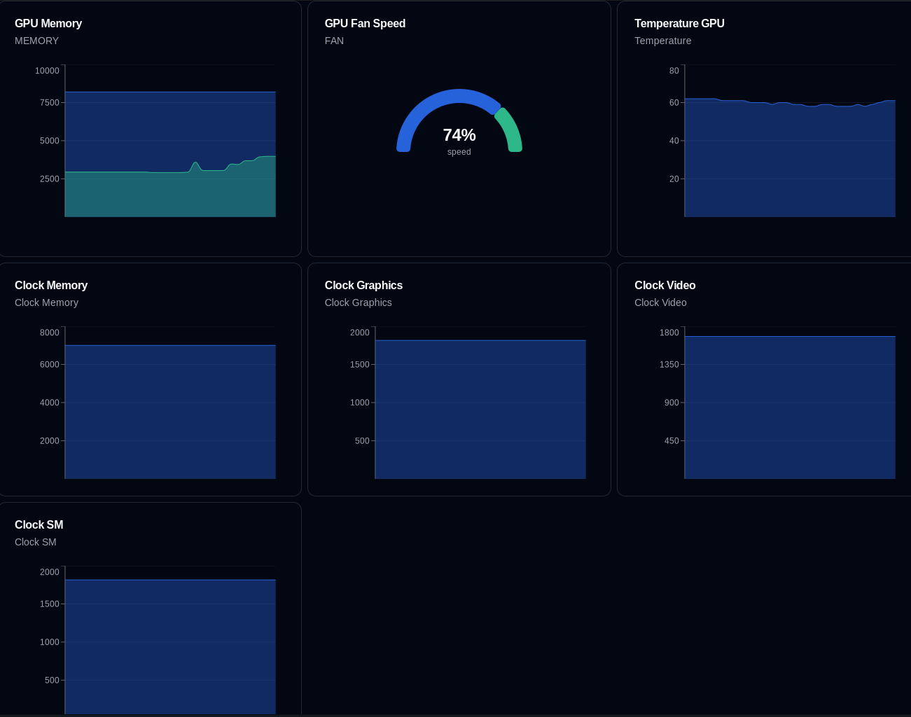

# NViewer - NVidia Monitor for Linux



NViewer is a lightweight, cross-platform application built using **Tauri**, **Rust**, and **React** to monitor Nvidia GPU metrics such as usage, temperature, memory, and more. It provides an intuitive UI to display real-time GPU statistics in an easily accessible format, making it perfect for system monitoring and performance tracking.

<p align=center>
  <a href="https://skillicons.dev">
    
  </a>
</p>

## Features

- Real-time Nvidia GPU usage monitoring (usage, temperature, memory, etc.)
- Lightweight, fast, and cross-platform thanks to Tauri's efficient packaging
- Intuitive and responsive UI built with React
- Written in Rust for maximum performance and safety
- Customizable update intervals for efficient resource usage
- Easy to set up and use

## Installation

### Prerequisites

Ensure that the following are installed on your system:

- [Rust](https://www.rust-lang.org/tools/install)
- [bun.js](https://bun.sh/) (for React)
- [Tauri](https://tauri.app/v1/guides/getting-started/prerequisites) dependencies
- Nvidia GPU drivers and the `nvidia-smi` tool installed

### Steps

1. Clone the repository:

   ```bash
   git clone https://github.com/stefanwerw/nviewer.git
   cd nviewer
   ```

2. install dependencies:

   ```bash
    bun i
   ```

3. Run dev:
   ```bash
    bunx tauri dev
   ```

### Usage

Once the application is running, you'll be able to monitor the following GPU metrics:

GPU Usage: Shows how much of the GPU is being utilized.
Temperature: Displays the current temperature of the GPU in Celsius.
Memory Usage: Visualizes total, used, and available memory on the GPU.
Power Consumption: Power usage in watts.
The data is updated in real-time, and the update interval can be adjusted in the settings.

### Screenshot

### Contributing

Contributions are welcome! Feel free to open issues or submit pull requests to improve the project.

### License

This project is licensed under the MIT License. See the LICENSE file for details.
